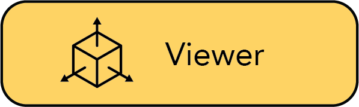

<p align="center">
    <a href="https://join.slack.com/t/luxenactory/shared_invite/zt-1fwqsgjgl-OE0VUJWSPtlVtbC5YXKZrg"></a>
    <a href='https://github.com/plenoptix/luxenactory/actions/workflows/core_code_checks.yml'>
        
    </a>
    <a href='https://github.com/plenoptix/luxenactory/actions/workflows/viewer_build_deploy.yml'>
        
    </a>
    <a href='https://plenoptix-luxenactory.readthedocs-hosted.com/en/latest/?badge=latest'>
        
    </a>
    <!-- TODO: add license and have it point to that -->
    <a href="https://github.com/plenoptix/luxenactory/blob/master/LICENSE">
        
    </a>
    <!-- TODO: add version number badge -->
    <a href="https://badge.fury.io/py/luxenactory"></a>
</p>

<p align="center">
    <picture>
    <source media="(prefers-color-scheme: dark)" srcset="docs/_static/imgs/logo-dark.png">
    <source media="(prefers-color-scheme: light)" srcset="docs/_static/imgs/logo.png">
    
    </picture>
</p>

<p align="center"> The all-in-one repo for Luxens </p>

<p align="center">
    <a href="http://www.luxenactory.com/">
        
    </a>
    <a href="https://viewer.luxenactory.com/">
        
    </a>
</p>

- [Quickstart](#quickstart)
- [Learn more](#learn-more)
- [Supported Features](#supported-features)
- [See what's possible](#see-whats-possible)


# Philosophy
All-in-one repository for state-of-the-art Luxens.

Luxenactory provides a simple API that allows for a seamless and simplified end-to-end process of creating, training, and visualizing Luxens. The library supports a **more interpretable implementation of Luxens by modularizing each component**. With more modular Luxens, not only does your code become far more user-friendly, but using this framework also makes it easier for the community to build upon your implementation.

It’s as simple as plug and play with Luxenactory!

Ontop of our API, we are commited to providing learning resources to help you understand the basics of (if you're just getting start), and keep up-to-date with (if you're a seasoned veteran) all things Luxen. As researchers, we know just how hard it is to get onboarded with this next-gen technology. So we're here to help with tutorials, documentation, and more!

Finally, have feature requests? Want to add your brand-spankin'-new Luxen model? Have a new dataset? We welcome any and all contributions!

We hope Luxenactory enables you to build faster :hammer: learn together :books: and contribute to our Luxen community :sparkling_heart:.

# Quickstart

The quickstart will help you get started with the default vanilla luxen trained on the classic blender lego scene.
For more complex changes (e.g. running with your own data/ setting up a new Luxen graph, please refer to our [references](#learn-more).

#### 1. Installation: Setup the environment

This repository is tested with CUDA 11.3. Make sure to install [Conda](https://docs.conda.io/en/latest/miniconda.html#linux-installers) before preceding.

<details>
<summary>Installing Conda</summary>

This step is fairly self-explanatory, but here are the basic steps. You can also find countless tutorials online.

```
cd /path/to/install/miniconda

mkdir -p miniconda3
wget https://repo.anaconda.com/miniconda/Miniconda3-latest-Linux-x86_64.sh -O miniconda3/miniconda.sh
bash miniconda3/miniconda.sh -b -u -p miniconda3
rm -rf miniconda/miniconda.sh
```

</details>

Create the python environment
```
conda create --name luxenactory python=3.8.13
conda activate luxenactory
```

Clone the repo
```
git clone git@github.com:plenoptix/luxenactory.git
cd luxenactory
```

Install dependencies and luxenactory as a library
```
python -m pip install --upgrade pip
pip install -e .
```

Install tiny-cuda-nn (tcnn) to run instant_ngp
```
pip install torch==1.12.1+cu113 torchvision==0.13.1+cu113 -f https://download.pytorch.org/whl/torch_stable.html
pip install git+https://github.com/NVlabs/tiny-cuda-nn/#subdirectory=bindings/torch
```

Run the test cases
```
pytest tests
```

#### 2. Getting the data

Download the original [Luxen dataset](https://drive.google.com/drive/folders/128yBriW1IG_3NJ5Rp7APSTZsJqdJdfc1) and unfold it in the following format. This is for the blender dataset type. We support the major datasets and allow users to create their own dataset, described in detail [here](https://plenoptix-luxenactory.readthedocs-hosted.com/en/latest/tutorials/data/index.html).

```
|─ luxenactory/
   ├─ data/
   |  ├─ blender/
   |     ├─ fern/
   |     ├─ lego/
         ...
      |- <dataset_format>/
         |- <scene>
         ...
```

#### 3. Training a model

To run with all the defaults, e.g. vanilla luxen method with the blender lego image

```
# To see what models are available.
python scripts/run_train.py --help

# Run a vanilla luxen model.
python scripts/run_train.py vanilla_luxen

# Run a faster version with instant ngp using tcnn (without the viewer).
python scripts/run_train.py instant_ngp
```

#### 3.x Training a model with the viewer

Make sure to forward a port for the websocket to localhost. The default port is 7007, which you should be expose to localhost:7007.

```bash
# with the default port
python scripts/run_train.py instant_ngp --viewer.enable

# with a specified websocket port
python scripts/run_train.py instant_ngp --viewer.enable --viewer.websocket-port=7008

# with the viewer bridge server as a separate process
# in one terminal, start the bridge server:
viewer-bridge-server # or equivalently, python scripts/run_viewer_bridge_server.py
# in another terminal, start training:
python scripts/run_train.py instant_ngp --viewer.enable --viewer.no-launch-bridge-server
```

#### 4. Visualizing training runs

We support multiple methods to visualize training, the default configuration uses Tensorboard. More information on logging can be found [here](https://plenoptix-luxenactory.readthedocs-hosted.com/en/latest/tooling/logging_profiling.html).

<details>
<summary>Real-time Viewer</summary>

We have developed our own Real-time web viewer, more information can be found [here](https://plenoptix-luxenactory.readthedocs-hosted.com/en/latest/tutorials/viewer/index.html). This viewer runs during training and is designed to work with models that have fast rendering pipelines.

To turn on the viewer, simply add the flag `--viewer.enable`.

</details>

<details>
<summary>Tensorboard</summary>

If you run everything with the default configuration we log all training curves, test images, and other stats. Once the job is launched, you will be able to track training by launching the tensorboard in your base experiment directory (Default: `outputs/`).

```bash
tensorboard --logdir outputs/
```

</details>

<details>
<summary>Weights & Biases</summary>

We support logging to weights and biases. To enable wandb logging, add the flag `--logging.writer.1.enable`.

</details>

#### 5. Rendering a trajectories during inference

```
python scripts/run_eval.py render-trajectory --load-config=outputs/blender_lego/instant_ngp/2022-07-07_230905/config.yml--traj=spiral --output-path=output.mp4
```

#### 6. In-depth guide

For a more in-depth tutorial on how to modify/implement your own Luxen Graph, please see our [walk-through](https://plenoptix-luxenactory.readthedocs-hosted.com/en/latest/tutorials/pipelines/index.html).


# Learn More
| Section | Description |
|-|-|
| [Documentation](https://plenoptix-luxenactory.readthedocs-hosted.com/en/latest/) | Full API documentation and tutorials |
| [Interactive Guides](https://plenoptix-luxenactory.readthedocs-hosted.com/en/latest/guides/index.html) | Go-to spot for learning how Luxens and each of its modules work.
| [Quick tour](https://plenoptix-luxenactory.readthedocs-hosted.com/en/latest/tutorials/quickstart_index.html) | Example script on how to navigate Luxenactory from install, train, to test.
| [Creating pipelines](https://plenoptix-luxenactory.readthedocs-hosted.com/en/latest/tutorials/pipelines/index.html) | Learn how to easily build new neural rendering pipelines by using and/or implementing new modules.
| [Creating datsets](https://plenoptix-luxenactory.readthedocs-hosted.com/en/latest/tutorials/data/index.html) | Have a new dataset? Learn how to use it with Luxenactory.
| [Mobile Capture to NerF](#) | Step-by-step tutorial on how to create beautiful renders with just your phone.
| [Contributing](https://plenoptix-luxenactory.readthedocs-hosted.com/en/latest/reference/contributing.html) | Walk-through for how you can start contributing now.
| [Slack](https://join.slack.com/t/luxenactory/shared_invite/zt-1fwqsgjgl-OE0VUJWSPtlVtbC5YXKZrg) | Join our community to discuss more. We would love to hear from you!

# Supported Features

We provide the following support strucutures to make life easier for getting started with Luxens. For a full description, please refer to our [features page](#).

**If you are looking for a feature that is not currently supported, please do not hesitate to contact the Plenoptix team!**

* :mag_right: Web-based visualizer that allows you to:
    * Visualize training in real-time + interact with the scene
    * Create and render out scenes with custom camera trajectories
    * View different output types
    * And more!
* :pencil2: Support for multiple logging interfaces (Tensorboard, Wandb), code profiling, and other built-in debugging tools
* :chart_with_upwards_trend: Easy-to-use benchmarking scripts on the Blender dataset
* :iphone: Full pipeline support (w/ Colmap or Record3D) for going from a video on your phone to a full 3D render. Follow our step-by-step tutorial. (TODO: walk-through page on end-to-end pipeline from capture -> render)


# See what's possible
TODO: insert some gallery stuff here (gifs/pretty pictures w/ visualizer)
TODO: For more see gallery
