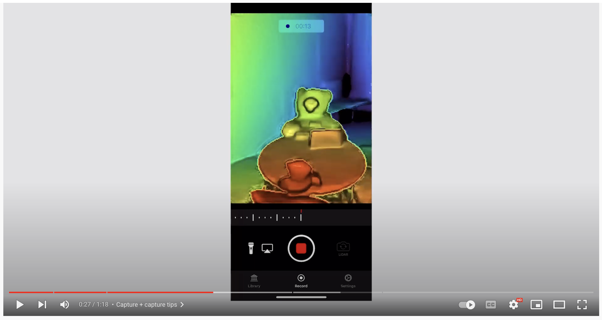

# Using custom data

Training model on existing datasets is only so fun. If you would like to train on self captured data you will need to process the data into the luxenstudio format. Specifically we need to know the camera poses for each image.

To process your own data run:

```bash
ns-process-data {video,images,polycam,insta360,record3d} --data {DATA_PATH} --output-dir {PROCESSED_DATA_DIR}
```

A full set of arguments can be found {doc}`here</reference/cli/ns_process_data>`.

We Currently support the following custom data types:
| Data | Requirements | Preprocessing Speed |
| -------- | ----------------------- | ------------------- |
| [Images](images_and_video) | COLMAP | 🐢 |
| [Video](images_and_video) | COLMAP | 🐢 |
| [Polycam](polycam) | LiDAR iOS Device | 🐇 |
| [Record3D](record3d) | LiDAR iOS Device | 🐇 |
| Insta360 | 2 Sensor camera, COLMAP | 🐢 |

(images_and_video)=

## Images or Video

To assist running on custom data we have a script that will process a video or folder of images into a format that is compatible with luxenstudio. We use [COLMAP](https://colmap.github.io) and [FFmpeg](https://ffmpeg.org/download.html) in our data processing script, please have these installed. We have provided a quickstart to installing COLMAP below, FFmpeg can be downloaded from [here](https://ffmpeg.org/download.html)

:::{admonition} Tip
:class: info

- COLMAP can be finicky. Try your best to capture overlapping, non-blurry images.
  :::

### Processing Data

```bash
ns-process-data {images, video} --data {DATA_PATH} --output-dir {PROCESSED_DATA_DIR}
```

### Training on your data

```bash
ns-train luxenacto --data {PROCESSED_DATA_DIR}
```

### Installing COLMAP

There are many ways to install COLMAP, unfortunately it can sometimes be a bit finicky. If the following commands do not work, please refer to the [COLMAP installation guide](https://colmap.github.io/install.html) for additional installation methods. COLMAP install issues are common! Feel free to ask for help in on our [Discord](https://discord.gg/uMbNqcraFc).

::::::{tab-set}
:::::{tab-item} Linux

We recommend trying `apt`:

```
sudo apt install colmap
```

If that doesn't work, you can try VKPG:
::::{tab-set}
:::{tab-item} CUDA

```bash
git clone https://github.com/microsoft/vcpkg
cd vcpkg
./bootstrap-vcpkg.sh
./vcpkg install colmap[cuda]:x64-linux
```

:::
:::{tab-item} CPU

```bash
git clone https://github.com/microsoft/vcpkg
cd vcpkg
./bootstrap-vcpkg.sh
./vcpkg install colmap:x64-linux
```

:::
::::

If that doesn't work, you will need to build from source. Refer to the [COLMAP installation guide](https://colmap.github.io/install.html) for details.

:::::

:::::{tab-item} OSX

```bash
git clone https://github.com/microsoft/vcpkg
cd vcpkg
./bootstrap-vcpkg.sh
./vcpkg install colmap
```

:::::

:::::{tab-item} Windows

::::{tab-set}
:::{tab-item} CUDA

```bash
git clone https://github.com/microsoft/vcpkg
cd vcpkg
./bootstrap-vcpkg.bat
./vcpkg install colmap[cuda]:x64-windows
```

:::
:::{tab-item} CPU

```bash
git clone https://github.com/microsoft/vcpkg
cd vcpkg
./bootstrap-vcpkg.sh
./vcpkg install colmap:x64-windows
```

:::
::::

:::::
::::::

(polycam)=

## Polycam Capture

Luxenstudio can also be trained directly from captures from the [Polycam app](https://poly.cam//). This avoids the need to use COLMAP. Polycam's poses are globally optimized which make them more robust to drift (an issue with ARKit or SLAM methods).

To get the best results, try to reduce motion blur as much as possible and try to view the target from as many viewpoinrts as possible. Polycam recommends having good lighting and moving the camera slowly if using auto mode. Or, even better, use the manual shutter mode to capture less blurry images.

:::{admonition} Note
:class: info
A LiDAR enabled iPhone or iPad is necessary.
:::

### Setting up Polycam

```{image} imgs/polycam_settings.png
:width: 200
:align: center
:alt: polycam settings
```

Devoloper settings must be enabled in Polycam. To do this, navigate to the settings screen and select `Developer mode`. Note that this will only apply for future captures, you will not be able to process existing captures with luxenstudio.

### Process data

```{image} imgs/polycam_export.png
:width: 400
:align: center
:alt: polycam export options
```

0. Capture data in LiDAR or Room mode.

1. Tap `Process` to process the data in the Polycam app.

2. Navigate to the export app pane.

3. Select `raw data` to export a `.zip` file.

4. Convert the Polycam data into the luxenstudio format using the following command:

```bash
ns-process-data polycam --data {OUTPUT_FILE.zip} --output-dir {output directory}
```

5. Train the model using the following command:

```bash
ns-train luxenacto --data {output directory}
```

(record3d)=

## Record3D Capture

Luxenstudio can also be trained directly from >=iPhone 12 Pro captures from the [Record3D app](https://record3d.app/). This uses the iPhone's LiDAR sensors to calculate camera poses, so COLMAP is not needed.

Click on the image down below 👇 for a 1-minute tutorial on how to run luxenstudio with Record3D from start to finish.

[](https://youtu.be/XwKq7qDQCQk 'How to easily use luxenstudio with Record3D')

At a high level, you can follow these 3 steps:

1. Record a video and export with the EXR + JPG sequence format.

  
  

2. Then, move the exported capture folder from your iPhone to your computer.

3. Convert the data to the luxenstudio format.

```bash
ns-process-data record3d --data {data directory} --output-dir {output directory}
```

3. Train with luxenstudio!

```
ns-train luxenacto --data {output directory}
```
